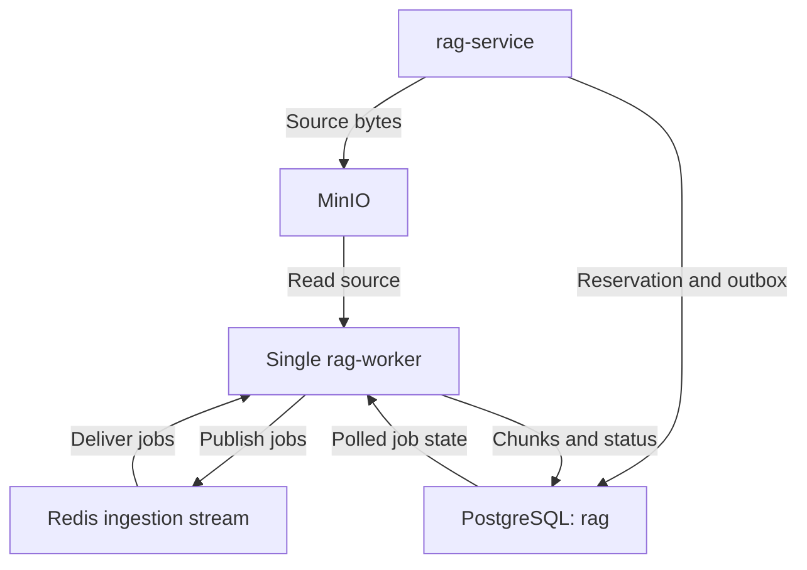

# Step 9 — asynchronous ingestion in the single rag-worker

Apply on `production-refactor` after Step 8 endpoints and worker cleanup are verified. Keep the three Compose files and `source scripts/dc.sh` shortcut. This step adds the actual Redis ingestion stream; the existing lifecycle stream remains separate.

## Behavior and implementation order

1. API validates filename/type and the upload limit without importing Docling. Accepted types remain PDF, DOCX, PPTX, HTML, Markdown and text. Empty files are rejected.
2. API allocates immutable document/job/source identities and commits a pending source reservation before writing bytes. Its owner lock rejects previously deleted users. A crashed write is now traceable through its reserved document/source fields.
3. API writes bytes outside the transaction. It then locks/rechecks the owner and reservation, marks the source ready and commits an ingestion outbox message with the document. **POST `/api/v1/documents` now returns 202 Accepted**, with document ID, job ID, Location and Retry-After headers. It no longer waits for parsing/embedding.
4. Worker publishes the outbox to `rag:ingestion:jobs`, then consumes it using group `rag-ingestion-workers`. Redis carries identifiers/version information, never file bytes.
5. Worker claims the document with a processing token/lease, loads the source, verifies checksum/size, parses, chunks and embeds. Model construction and chunking stay off the event loop; DB transactions are not held during model work.
6. Worker locks the owner/document and validates job identity, generation, processing configuration, token and unexpired lease before atomically committing chunks, metadata and ingested status. Duplicate or stale deliveries cannot commit extra chunks.
7. Transient failures commit a delayed retry before Redis ACK. Up to three failed attempts are allowed by default. Invalid embeddings/known content failures are terminal. Terminal jobs publish a dead-letter envelope to `rag:ingestion:dlq`; raw sources remain for inspection.
8. Reconciliation recovers expired processing leases and interrupted source reservations. If a ready pending job's broker entry is lost, it can be republished from DB state. Upload failures/in-flight deletion use delayed source cleanup to avoid deleting while a bounded write is still underway.



The same worker also runs lifecycle deletion and source cleanup. There is one sequential ingestion consumer, an outbox loop and a recovery loop; no second worker container.

## Exact changes

| Relative path | Action |
| --- | --- |
| `packages/rag-contracts/rag_contracts/ingestion_job.py` | New validated/versioned job envelope |
| `packages/rag-contracts/rag_contracts/__init__.py` | Export new envelope; preserve existing types |
| `services/rag-service/app/core/config.py` | Your uploaded config plus queue settings/validation |
| `services/rag-service/app/api/v1/endpoints/documents.py` | Async acceptance and owner-scoped GET status |
| `services/rag-service/app/schemas/ingestion.py` | New response extending existing DocumentOut |
| `services/rag-service/app/workflows/` | New submission, state, broker, execution and pure-policy modules |
| `services/rag-service/app/rag/ingestion/base.py` | Add reservation methods while keeping legacy save/read/delete implementations compatible |
| `services/rag-service/app/rag/ingestion/storage.py` | Add source allocation and write-to-reserved-location; retain save/read/delete |
| `services/rag-service/app/rag/ingestion/source_types.py` | Export the existing parser-supported types |
| `services/rag-service/app/rag/ingestion/factory.py` | Lazy model imports; same existing backends |
| `services/rag-service/app/events/source_cleanup.py` | Allow delayed cleanup for in-flight writes |
| `services/rag-service/app/events/consumer.py` | Preserve lifecycle behavior; delay cleanup of reserved sources |
| `services/rag-service/app/worker.py` | Supervise ingestion, publication and recovery alongside lifecycle/cleanup |
| `services/rag-service/app/cli/inspect_ingestion_queue.py` | Queue/database diagnostics without credentials |
| `services/rag-service/app/tests/unit/test_ingestion_contract.py` | Envelope, vector and lease-fencing tests |
| `services/rag-service/app/tests/integration/check_ingestion_queue.py` | Real DB/Redis/storage durability probe with injected model backends |
| `docker-compose.worker.yml` | Queue settings and existing model-directory mount for worker |

Keep `app/main.py`, router.py, parser implementations, original document schema and all shared persistence models. The old synchronous `pipeline.py` can remain as a compatibility implementation, but the upload endpoint no longer calls it. Do not run that old ingestion entry point for queue jobs.

No new dependency or migration is required. Step 5 already supplied the job, lease, provenance and outbox fields. Both Alembic heads/current remain `a6f31c9e204b`.

The config replacement is based on your just-uploaded `config(1).py`, including the localhost Redis default and Step 7/8 settings. If you changed that file after uploading, merge the queue additions instead of overwriting those changes.

## 1. Apply and run unit checks

Let any active synchronous upload finish before the cutover. Extract the ZIP into the repository root, then run:

```bash
source scripts/dc.sh
cd services/rag-service
uv sync --locked
uv run python -m unittest app.tests.unit.test_ingestion_contract app.tests.unit.test_source_storage -v
cd ../..
dc config --quiet
dc build rag-service
```

Both API and worker use the rebuilt RAG image. Keep the existing model downloads at `services/rag-service/models`; this step adds that bind mount to the worker.

Defaults are supplied in code and Compose. Optional root `.env.compose` additions (also add placeholders/defaults to your root example):

```dotenv
INGESTION_STREAM=rag:ingestion:jobs
INGESTION_CONSUMER_GROUP=rag-ingestion-workers
INGESTION_DLQ_STREAM=rag:ingestion:dlq
```

Redis remains the same instance/database as `EVENTS_REDIS_URL`. It still requires Redis 6.2+ and the existing lifecycle/stream permissions; the ingestion account also needs XADD, XREADGROUP, XACK, XAUTOCLAIM and XGROUP. Do not rename the existing lifecycle stream/group.

## 2. Stop the old worker and run the durability probe

The probe must run with rag-worker stopped so its loops do not race the probe's disposable rows:

```bash
dc stop rag-worker
dc run --rm --no-deps rag-service python -m app.tests.integration.check_ingestion_queue
```

The probe uses the actual PostgreSQL, Redis and configured source storage. It injects small parser/chunker/embedder implementations to verify transaction and queue behavior without Docling inference. It checks:

- Acceptance survives a simulated publication failure and is published on retry.
- Duplicate delivery leaves the same chunk rows.
- Transient failures retry; repeated failures stop at the configured limit.
- Invalid vectors produce zero chunks and a durable DLQ message.
- Expired leases are recovered; an old token cannot commit.
- An interrupted source reservation becomes failed and is cleaned.
- Deleting the disposable owner fences its queued jobs.

It creates one random owner without touching Auth, removes only its own source/DB rows, and removes the Redis entries it created. It initializes the ingestion group/streams but does not delete shared streams/groups. If interrupted before cleanup, its disposable rows/objects may need removal. Do not enable the API cutover until this probe passes.

## 3. Enable the new API and worker together

```bash
dc stop rag-service
dc up -d --force-recreate minio-init
dc up -d --force-recreate rag-service rag-worker
dc ps
dc logs --tail=100 rag-worker
```

Expected worker logs include `rag_worker_started` and `ingestion_consumer_started`. The API must still report `RUN_LIFECYCLE_CONSUMER=False`, worker True. Continue using all three overlays.

Check schema parity if needed:

```bash
dc run --rm --no-deps rag-service alembic current
dc run --rm --no-deps rag-service alembic heads
```

## 4. Verify the actual upload and polling flow

Log in through Auth and authorize RAG docs as before. Upload a small supported document using POST `/api/v1/documents`:

- Expect HTTP **202**, not 201.
- Save its `id` and `job_id`.
- Poll GET `/api/v1/documents/{id}` every two seconds using the same user's token.
- Status proceeds from `pending` to `processing` to `ingested`, or to `failed` with `failure_reason`. Fast jobs may finish before a poll observes processing.
- Search that document only after it is ingested.

Existing documents continue to list/search; legacy rows can have null job IDs. Status access is owner scoped: another user's token receives 404.

Verify the stored source:

```bash
dc exec rag-service python -m app.tests.integration.check_document_source YOUR_DOCUMENT_UUID
```

New MinIO objects now use `raw/<owner UUID>/<document UUID>.<extension>`, so open the owner's subfolder in the console. Previously stored object keys remain readable; nothing is automatically migrated or re-embedded.

## 5. Inspect RedisInsight and prove catch-up

```bash
dc exec rag-worker python -m app.cli.inspect_ingestion_queue
```

Connect RedisInsight to the same Redis instance/database number shown. Refresh the key list and inspect the stream `rag:ingestion:jobs`. A successful ACK clears the pending delivery, not retained stream history. Therefore an empty pending count is normal after successful processing. The dead-letter stream may be absent/empty until a terminal failure occurs.

The API does not directly publish to Redis: worker outbox publication does. With rag-worker stopped, accepted jobs are durable in PostgreSQL and may not yet appear in Redis. On restart the worker publishes and processes them.

To verify this:

```bash
dc stop rag-worker
```

Upload a new small document; expect 202 and pending status. Then:

```bash
dc start rag-worker
dc logs --tail=100 rag-worker
```

Poll until ingested. This checks acceptance without a running worker and recovery after it resumes. The queue code tolerates publication outages, but API authentication/rate limiting still has its existing Redis dependencies.

Finally, use a disposable test account to queue a document while the worker is stopped, delete the account through Auth, then restart the worker. Verify its rows/MinIO sources disappear and queued work cannot recreate them. If ingestion wins a brief race before the lifecycle event is consumed, the subsequent deletion still purges it; the durable deletion fence prevents later commits.

## Settings and current limits

- Processing lease: 180 seconds; heartbeat: 30 seconds.
- Attempt timeout: 900 seconds. Transient failure budget: three failed attempts, with default delays 15 and 30 seconds.
- Recovery scans every 10 seconds. A ready pending job can be republished after 60 seconds if its published broker entry is lost.
- Upload reservation: 600 seconds. In-flight/ambiguous source writes can defer cleanup to the reservation deadline plus 30 seconds. Already accepted sources are deleted normally through the existing cleanup loop.
- Redis pending messages and outbox records are not automatically trimmed/deleted in this patch. Establish retention separately; do not trim entries that may still be needed for recovery.
- Changes to processing settings are fingerprinted. A queued job with different worker processing settings fails with `processing_configuration_changed` rather than silently using another pipeline.
- Python cannot forcibly stop a native conversion thread. Timeout/lease fencing prevents stale DB commits, but a conversion can continue until its thread finishes or the worker process exits. Your existing parser's threading semaphore still bounds conversion concurrency. External Docling Serve comes next.
- Parser/chunk embedding now run in the worker. Query embedding still uses the API's current provider, so model dependencies remain in the shared image and BGE can be loaded in both processes until the embedding-service step centralizes it.

## Rollback and next step

This changes the upload contract. Update clients to accept 202 and poll; do not treat 202 as completed ingestion. Do not restore the old synchronous endpoint while accepted jobs are pending/processing. First pause new uploads, drain or explicitly resolve those jobs, and stop the worker before any code rollback. Keep all source volumes and database records.

Step 9 is complete after the durability probe, real-model upload/poll/search, worker stop/start and user-deletion checks pass. Next: Docling Serve integration, then BGE ONNX embedding service and slimmer API/worker images. The single worker remains.

## Validation provided

Eleven deterministic contract/vector/fencing/storage tests passed in the authoring environment; Python syntax and Compose structure were checked. Docker and actual PostgreSQL/Redis/MinIO services are unavailable there. The supplied integration probe and real endpoint tests must run on your machine before this cutover is considered verified.

Redis semantics references:
- https://redis.io/docs/latest/commands/xreadgroup/
- https://redis.io/docs/latest/commands/xautoclaim/
